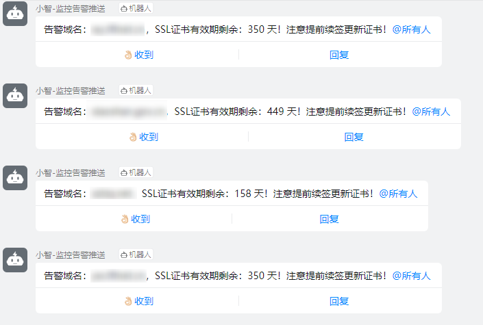

# check_domain_ssl_to_Dingtalk
shell脚本实现监控SSL证书有效期，并联动钉钉推送

## 实现效果

## 方法一
check_online_domain_ssl.sh
此方法针对公网在线域名SSL情况

## 方法二
check_crt_domain_ssl.sh
此方法针对有域名crt证书文件的情况

详情见博文：https://blog.csdn.net/M110K/article/details/115484483
